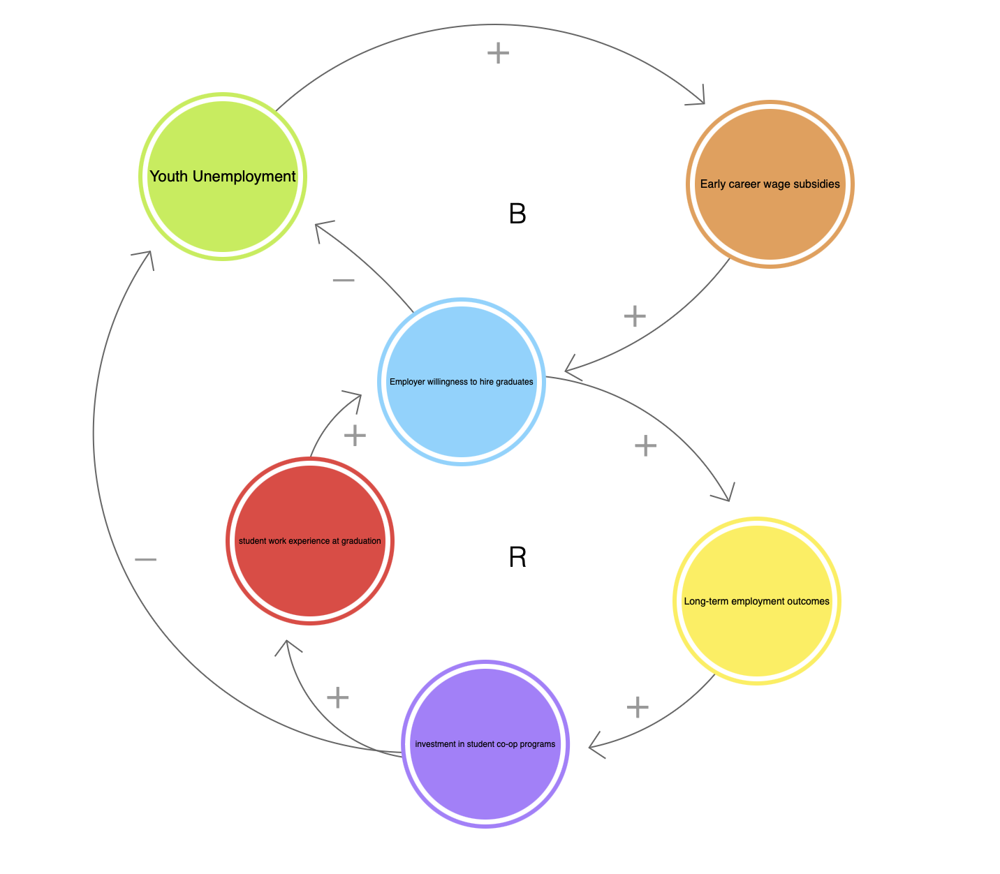

# NS-Youth-Employment
# Project Title
 Student Co-op vs New Grad Interventions in Youth Employment Policy

## Decision Statement
Should the Nova Scotia Department of Labour focus youth employment resources on early-career wage subsidies for recent graduates, or on investments in student co-op and work-integrated learning programs, to improve long-term youth employment outcomes?

## Executive Summary
Youth unemployment and underemployment remain persistent challenges in Nova Scotia, particularly for young people transitioning from education into the labour market. Employers frequently cite a lack of work experience as a barrier to hiring recent graduates, while graduates struggle to secure meaningful employment without prior exposure to workplace environments. In response, governments have implemented a range of youth employment supports, including wage subsidies for recent graduates and investments in student co-op and work-integrated learning (WIL) programs.

This project examines a policy tradeoff facing the Nova Scotia Department of Labour: whether limited youth employment resources should be prioritized toward early-career wage subsidies or toward upstream investments in co-op and WIL programs. Wage subsidies aim to reduce hiring costs and stabilize employment outcomes in the short term, while co-op and WIL programs seek to improve graduate readiness and job matching before labour market entry. Understanding how these interventions interact is critical for improving long-term employment outcomes and retaining young talent in the province.

## Initial Causal Loop Diagram

**CLD Explanation:**  
The causal loop diagram illustrates two competing approaches to youth employment policy. Investments in student co-op programs form a reinforcing loop by increasing graduate work experience, employer willingness to hire, and long-term employment outcomes. In contrast, early-career wage subsidies create a balancing loop that reduces youth unemployment by lowering hiring costs for employers.
